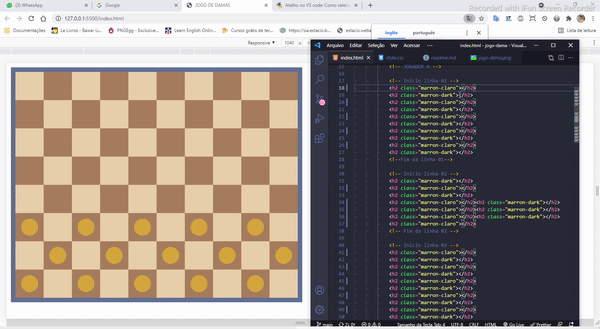

<h1>Projeto Jogo de Damas 💻😉</h1>

<a href="https://araujoleonardo310.github.io/jogo-de-damas/">🔗Clique aqui!</a>

## Sobre

> Decidi recriar verão page do tabuleiro do Jogo de Damas. Foi desenvolvido por inspiração, desafio e muito respeito, porque amava brincar nesse jogo. Percebo que este jogo proporcionou-me ser alguém calmo, estrategista, persistente e, também criativo com jogadas e blefes (rsrs).

## Status ✌️

### Projeto concluído 🚀

## Recursos & Ferramentas 

* Git 
* Github 
* Visual Studio Code 
* Html 
* CSS 
* Seletor de cores (imagens online)

## O quê aprendi 🧑‍💻

- Posicionamento de elementos
- Sequência e lógica de elementos no corpo da página
- Classes
- Divs
- Análise e captura de cores a partir de uma imagem
- Noções de espaçamento entre elementos (margin)
- Noções de alinhamento entre elementos(Width e Height)

## 🐧🖖 Créditos & 🔗 Referências 

Wikipédia: [Jogo de Damas](https://pt.wikipedia.org/wiki/Damas) 
Imagem referência [Jogo de Damas](https://pt.wikipedia.org/wiki/Damas#/media/Ficheiro:International_draughts.jpg) 
IMAGECOLORPICKER - [Saiba mais!](https://imagecolorpicker.com/pt-pt)

## Autor do projeto 👊
 

### Leonardo Araújo  
**Universitário 🧑‍🎓 de Sistemas de Informação 💻**

 

***"Se você tiver disposição de aprender e tentar então, seu sucesso está definido! ✨"*** 

